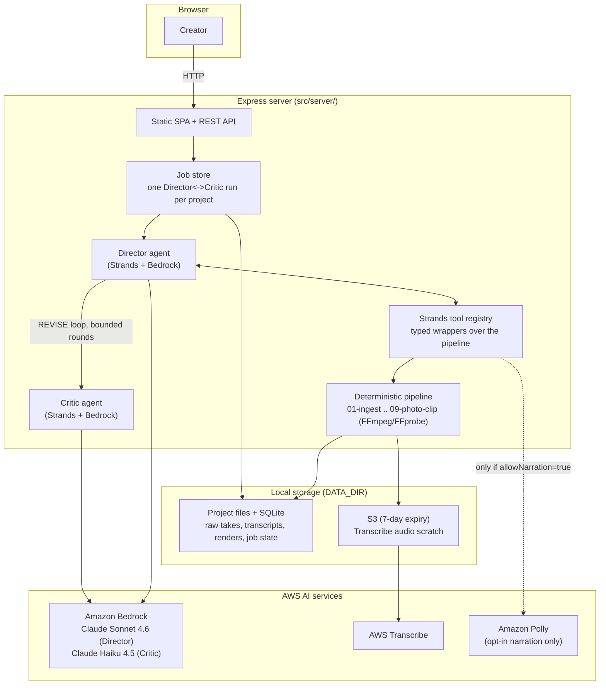
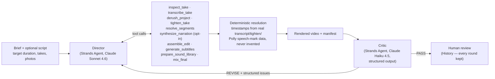

# HI-SHIN — Architecture

Two diagrams: the system as this repository runs it (request path, storage,
AWS services it calls), and the agent loop itself — the part that actually
decides what goes in the video.

A separately hosted, multi-user deployment of this same core (with
Cognito login and per-account isolation) exists at
[hishin.globalnavigator.app](https://hishin.globalnavigator.app) as a live
demo; that hosting layer is additional infrastructure around this repo, not
part of it, and isn't shown below — this repo runs standalone, no login
required.

## System architecture

Notes that matter more than the boxes:

- **The pipeline and agents have no concept of users.** They only ever know
  a `projectId`. That's what let a multi-user hosted deployment (Cognito
  login, per-account isolation) be added as a layer *around* this system
  without touching the media pipeline or the agent loop at all.
- **Amazon Polly is opt-in, not automatic.** `list_voices`/`synthesize_narration`
  are only registered as tools for the Director when the human explicitly
  sets `allowNarration: true` for that run — otherwise the model literally
  cannot call them, not just discouraged from it by a prompt.
- **AWS credentials come from the standard SDK chain** (env vars, shared
  config/profile, or an execution role if you deploy this yourself) — never
  hardcoded, never passed through the agent.

## The agent loop

The one rule the whole system exists to enforce: **the Director selects
semantic IDs (`take_04_s02`, a `narration_id` it just generated) — it never
supplies a timestamp.** `assemble_edit` resolves every ID against real
transcript/tighten/Polly data on disk; an ID that doesn't resolve fails the
tool call loudly, with no render produced. That boundary is asserted by a
scripted adversarial test in `tests/integration/agent-tools.spec.ts`, not
just by the system prompt.

The Critic never edits video. It receives the brief, the *measured* duration
(ffprobe, never recomputed by the model), the subtitle/narration text, and
sampled frames — and returns `PASS` or `REVISE` with structured issues
(`duration`, `cta`, `coherence`, `brand`, `audio`, `other`). Revisions are
bounded (`MAX_REVISION_ROUNDS`); every round's render, editorial reasoning,
and critique stay in history, even if the loop ends on `REVISE` rather than
`PASS` — the system reports what it actually achieved, it doesn't force a
passing grade.
