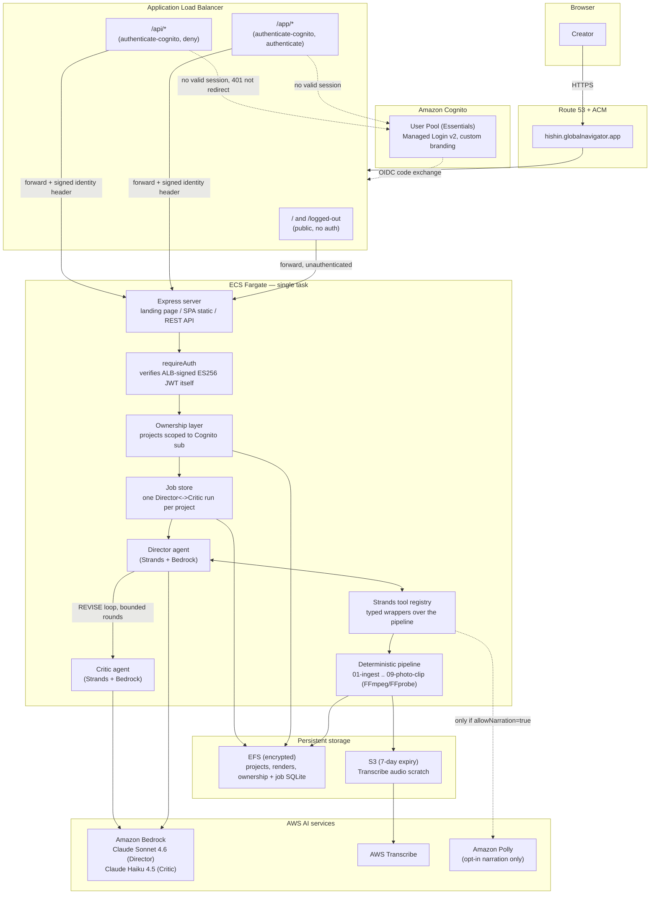
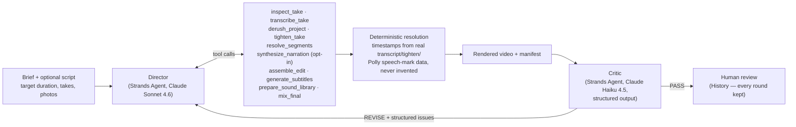

# HI-SHIN — Architecture

Two diagrams: the production system (request path, AWS services, multi-user
isolation), and the agent loop itself (the part that actually decides what
goes in the video). Both reflect what is deployed at
[hishin.globalnavigator.app](https://hishin.globalnavigator.app), not a
planned or aspirational version.

## System architecture

Notes that matter more than the boxes:

- **`/` is not behind Cognito.** The marketing landing page is a single
  self-contained HTML file (inline CSS/JS/images) so it can be the one ALB
  path exempt from auth without leaking a login-gated stylesheet request.
  Everything else — `/app` (the SPA) and `/api` (the REST surface) — sits
  behind the ALB's `authenticate-cognito` action.
- **The app never trusts the ALB blindly.** `authenticate-cognito` attaches a
  signed `x-amzn-oidc-data` header; `requireAuth` (`src/server/auth.ts`)
  independently re-verifies its ES256 signature against ALB's own public key
  endpoint, and checks `signer`/`client`/`exp` itself. A misconfigured
  security group reaching the task directly still can't get in.
- **Multi-user isolation lives in exactly one place.** The pipeline and
  agents only ever know a `projectId` — they have no concept of users. A
  separate ownership table (`project_owners`, keyed by Cognito `sub`) is the
  only thing that maps a project to an account, enforced at the server layer
  before any route touches project data.
- **Amazon Polly is opt-in, not automatic.** `list_voices`/`synthesize_narration`
  are only registered as tools for the Director when the human explicitly
  sets `allowNarration: true` for that run — otherwise the model literally
  cannot call them, not just discouraged from it by a prompt.
- **One task, on purpose.** This is a hackathon-to-production pilot, not a
  claim of high availability: a single Fargate task, deployed with
  start-before-stop rollout and a long ALB deregistration delay so an
  in-flight upload survives a deploy, but still one process.

## The agent loop

The one rule the whole system exists to enforce: **the Director selects
semantic IDs (`take_04_s02`, a `narration_id` it just generated) — it never
supplies a timestamp.** `assemble_edit` resolves every ID against real
transcript/tighten/Polly data on disk; an ID that doesn't resolve fails the
tool call loudly, with no render produced. That boundary is asserted by a
scripted adversarial test in `tests/integration/agent-tools.spec.ts`, not
just by the system prompt.

The Critic never edits video. It receives the brief, the *measured* duration
(ffprobe, never recomputed by the model), the subtitle/narration text, and
sampled frames — and returns `PASS` or `REVISE` with structured issues
(`duration`, `cta`, `coherence`, `brand`, `audio`, `other`). Revisions are
bounded (`MAX_REVISION_ROUNDS`); every round's render, editorial reasoning,
and critique stay in history, even if the loop ends on `REVISE` rather than
`PASS` — the system reports what it actually achieved, it doesn't force a
passing grade.
